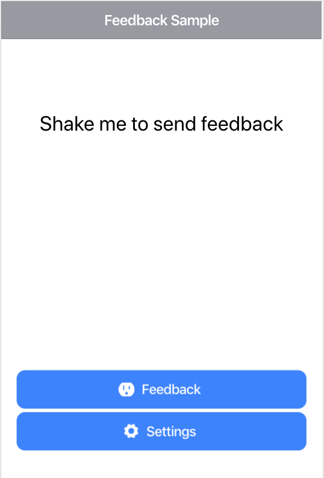
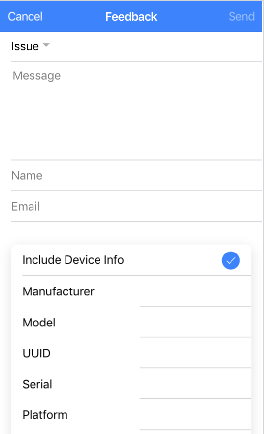

# ionic-feedback-sample

[](https://travis-ci.org/Ritzlgrmft/ionic-feedback-sample)
[](https://david-dm.org/ritzlgrmft/ionic-feedback-sample/master)
[](https://david-dm.org/ritzlgrmft/ionic-feedback-sample/master?type=peer)
[](https://david-dm.org/ritzlgrmft/ionic-feedback-sample/master?type=dev)
[](http://commitizen.github.io/cz-cli/)

The feedback sample is a small Ionic app demonstrating the usage of
[ionic-feedback-service](https://github.com/Ritzlgrmft/ionic-feedback-service) and
[ionic-feedback-viewer](https://github.com/Ritzlgrmft/ionic-feedback-viewer).

## Screenshots

| Home Page | Feedback Page | Feedback Modal |
| ---------- | ------------- | ----------- |
|  |  |  |

## Usage

```bash
git clone https://github.com/Ritzlgrmft/ionic-feedback-sample.git
cd ionic-feedback-sample
npm install
ionic serve
```

## Todos

- translate feedback alert

- show spinner during send
- simulator: send cors problem
- implement error handler